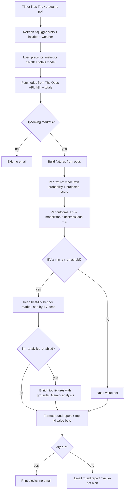

# AFLPulse Scanner (`afl-pulse`) — Logic Reference

AFL value-betting scanner. Fetches match odds, computes model win probabilities, finds **positive expected-value (EV)** bets, optionally enriches them with grounded Gemini analytics, and **emails a round report**. Alert-only — it places no bets and touches no OANDA account.

| Item | Value |
|------|-------|
| Binaries | `cmd/afl-pulse` (weekly round report), `cmd/afl-pulse-pregame` (per-match pre-kickoff alerts) |
| Training / research | `cmd/afl-train` (fit model coefficients), `cmd/afl-backtest` (evaluate) |
| Schedule | `afl-pulse.timer` — Thu 18:00 Australia/Melbourne |
| On demand | `sudo systemctl start afl-pulse.service` or `./scripts/afl-pulse-run.sh` |
| Safe test | `go run ./cmd/afl-pulse -dry-run` |
| Config block | `.credentials` → `afl` (+ shared `email`, `notifications`) |
| Data sources | The Odds API (odds), Squiggle API (stats), optional Gemini (analytics), Open-Meteo (weather) |
| Output | Email round report / value-bet alerts (no orders, no state DB) |

**Enable:** set `afl.odds_api_key` in `.credentials` (`Enabled()` / `Validate()` gate on it).

---

## Source map (read these, not the whole repo)

| Topic | File |
|-------|------|
| Weekly round entry point | `cmd/afl-pulse/main.go` |
| Pre-kickoff alert entry point | `cmd/afl-pulse-pregame/main.go` |
| EV evaluation, value-bet selection | `internal/afl/evaluator.go` |
| EV formula + domain types | `internal/afl/domain.go` (`ComputeEV`) |
| Win-probability / score model | `internal/afl/score.go`, `internal/afl/predictor.go`, `internal/afl/linear_predictor.go` |
| Feature engineering | `internal/afl/features.go`, `internal/afl/totals_features.go` |
| Pregame poll + dedup | `internal/afl/pregame.go`, `internal/afl/pregame_notify.go` |
| Gemini grounded analytics | `internal/afl/llm_analytics.go`, `internal/afl/gemini/client.go` |
| Odds API client | `internal/afl/odds/client.go` |
| Squiggle stats + repository | `internal/afl/stats/squiggle.go`, `internal/afl/stats/repository.go` |
| Email formatting | `internal/afl/notify.go`, `internal/afl/reasons.go` |
| Model training | `internal/afl/train/ml.go`, `cmd/afl-train/main.go` |
| Config defaults + keys | `internal/config/afl.go` (`AFLConfig`, `DefaultAFLConfig`) |

---

## Code organisation & storage (where to find things)

### Code layout

```
cmd/
├── afl-pulse/main.go            # weekly round report
├── afl-pulse-pregame/main.go    # per-match pre-kickoff alerts (deduped)
├── afl-train/main.go            # fit H2H / totals coefficient models
└── afl-backtest/main.go         # evaluate model over history
internal/afl/
├── evaluator.go                 # EV evaluation, value-bet selection
├── domain.go                    # types + ComputeEV
├── score.go, predictor.go, linear_predictor.go  # win-prob / score models
├── features.go, totals_features.go              # feature engineering
├── pregame.go, pregame_notify.go, pregame_llm.go # pregame poll + dedup + LLM
├── llm_analytics.go             # grounded Gemini enrichment
├── notify.go, reasons.go        # email formatting
├── odds/client.go               # The Odds API client
├── stats/squiggle.go, stats/repository.go        # Squiggle stats
├── gemini/client.go             # Gemini client
├── weather/client.go            # Open-Meteo
└── train/ml.go                  # model training
internal/config/afl.go           # AFLConfig + DefaultAFLConfig
scripts/afl-pulse-run.sh         # manual run helper
```

Uses shared `internal/notify` (email) and `internal/config`. It does **not** import the `bot` platform, `oanda`, `risk`, `execution`, or `state`.

### Runtime artifacts (data files, models, dedup state)

AFLPulse holds no trading state, but it **does** read/write files under `stats_dir` (default `data/afl/`) — this is where models, seed data, and pregame dedup live.

| Artifact | Path (default) | Written/read by | Notes |
|----------|----------------|-----------------|-------|
| **H2H model** | `data/afl/model_coefficients.json` | `cmd/afl-train` (write), scanner (read) | `model_path` |
| **Totals model** | `data/afl/totals_coefficients.json` | `cmd/afl-train` (write), scanner (read) | `totals_model_path` |
| **ONNX model** | `onnx_model_path` (unset by default) | external export | used when `predictor_type=onnx` |
| **Seed / live stats** | `data/afl/` (`teams.json` + Squiggle refresh) | `internal/afl/stats/repository.go` | `stats_dir`; refreshed on run when `stats_refresh_on_run` |
| **Injuries** | `data/afl/injuries.json` | operator / `-injuries` flag | `injuries_file` |
| **Pregame dedup state** | `data/afl/pregame-sent.json` | `internal/afl/pregame_notify.go` | `pregame_state_path`; ensures each match alerts once |
| **Odds** | in-memory per run | `internal/afl/odds/client.go` | The Odds API; no cache |
| **Output** | email (via shared `email` config) | `internal/afl/notify.go` | `-dry-run` prints instead |
| **Process logs** | systemd journal (`journalctl -u afl-pulse` / `afl-pulse-pregame`) | slog → stdout | |

---

## Algorithm diagram



Pregame variant (`afl-pulse-pregame`) runs the same evaluation but only alerts for matches whose kickoff falls within `pregame_lead_minutes` (± `pregame_poll_window_minutes`), deduping already-sent matches via `pregame_state_path`.

---

## Algorithm

### 1. Inputs
- **Odds** — The Odds API (`odds_sport_key=aussierules_afl`, `odds_regions`, `odds_markets=h2h,totals`); odds older than `max_odds_age_minutes` are treated as stale.
- **Stats** — Squiggle API refreshed on run (`stats_refresh_on_run`) into `stats_dir`, falling back to seed `teams.json`.
- **Injuries** — optional `injuries_file` (or `-injuries` override) adjusts team strength.
- **Weather** — Open-Meteo per venue, folded into the context builder.

### 2. Model
`NewPredictor(predictor_type, model_path, onnx_model_path)` builds either:
- **`matrix`** (default) — coefficient model from `model_path` / totals from `totals_model_path`, or
- **`onnx`** — an exported ONNX predictor at `onnx_model_path`.

The predictor produces each team's **win probability** and a projected total (for `totals` markets), using engineered features (recent form, home advantage, injuries, weather).

### 3. Expected value & value bets (`evaluator.go`)
For every bookmaker outcome:

```
EV = (modelProb × decimalOdds) − 1        # ComputeEV, domain.go
```

- An outcome is a **value bet** when `EV ≥ min_ev_threshold` (default 0.05 = +5% edge).
- The evaluator keeps the **best-EV bet per market** and sorts descending by EV.
- `alert_top_n` (default 5) value bets are surfaced in the alert.

### 4. Optional Gemini analytics
When `AnalyticsEnabled()` (requires `gemini_api_key` **and** `llm_analytics_enabled=true`), the top fixtures are enriched with grounded search analytics via `gemini_model` (default `gemini-2.5-flash-lite`). This is opt-in and off by default (paid API); the run timeout is bumped to ≥15 min to allow for grounded search latency.

### 5. Output
- **`afl-pulse`** emails a full round report (per-fixture projections + value bets). `-value-only` (legacy) emails only when value bets exist; `-dry-run` prints blocks without sending.
- **`afl-pulse-pregame`** emails per-match alerts shortly before kickoff, deduped so each match fires once.

---

## Configuration (`afl` block)

Defaults from `DefaultAFLConfig` (`internal/config/afl.go`).

| Key | Default | Effect |
|-----|---------|--------|
| `odds_api_key` | — (**required**) | Enables the scanner |
| `min_ev_threshold` | 0.05 | Minimum edge to flag a value bet (+5%) |
| `concurrency` | 4 | Parallel fixture evaluation |
| `max_odds_age_minutes` | 30 | Reject stale odds |
| `alert_top_n` | 5 | Value bets shown in alert |
| `overall_timeout_minutes` | 5 (→15 if analytics) | Whole-run deadline |
| `odds_api_base_url` | `https://api.the-odds-api.com/v4` | Odds endpoint |
| `odds_sport_key` | `aussierules_afl` | Sport |
| `odds_regions` | `au` | Bookmaker regions |
| `odds_markets` | `h2h,totals` | Markets fetched |
| `predictor_type` | `matrix` | `matrix` or `onnx` |
| `model_path` | `data/afl/model_coefficients.json` | H2H coefficient model |
| `totals_model_path` | `data/afl/totals_coefficients.json` | Totals model |
| `onnx_model_path` | — | ONNX model (when `predictor_type=onnx`) |
| `stats_dir` | `data/afl` | Squiggle stats + seed data |
| `injuries_file` | `data/afl/injuries.json` | Injury overrides |
| `stats_refresh_on_run` | true | Refresh Squiggle before each run |
| `stats_season_year` | current year | Season for stats refresh |
| `squiggle_user_agent` | `AFLPulse/1.0 fxtrade` | Squiggle API UA |
| `gemini_api_key` | — | Enables Gemini analytics (with flag) |
| `gemini_model` | `gemini-2.5-flash-lite` | Analytics model |
| `llm_analytics_enabled` | false | Opt-in grounded analytics |
| `llm_concurrency` | 2 | Parallel Gemini calls |
| `pregame_lead_minutes` | 45 | How far before kickoff to alert |
| `pregame_poll_window_minutes` | 5 | Poll window width after lead |
| `pregame_state_path` | `<stats_dir>/pregame-sent.json` | Dedup state for pregame alerts |
| `pregame_llm_required` | true | Require LLM for pregame alerts |
| `pregame_llm_retries` | 4 | Retries after first LLM attempt |

### Key knobs
- **`min_ev_threshold`** — the core edge filter; raise to be more selective.
- **`predictor_type` / `model_path`** — swap the win-probability model (retrain via `cmd/afl-train`).
- **`llm_analytics_enabled` + `gemini_api_key`** — turn on paid grounded analytics.
- **`pregame_lead_minutes`** — timing of pre-kickoff alerts.

---

## Quick inspection commands

```bash
# Weekly round report, printed, no email
go run ./cmd/afl-pulse -dry-run

# Only alert when value bets exist (legacy)
go run ./cmd/afl-pulse -value-only

# Retrain the H2H / totals coefficient models
go run ./cmd/afl-train

# Backtest the model over historical data
go run ./cmd/afl-backtest
```

---

## vs other scanners / bots

| | `afl-pulse` | `nifty-pulse` | Platform bots |
|--|-------------|---------------|---------------|
| Market | AFL betting | NSE equities | OANDA FX/CFD |
| Action | Email alert | Email alert | Live orders |
| Signal | Positive-EV odds vs model | SMA uptrend + RSI pullback | See per-bot specs |
| External APIs | Odds API, Squiggle, Gemini | Yahoo, Groq | OANDA (+ Finnhub/Groq for fx_sentiment) |

---

## Maintenance

Keep this doc aligned with code: **`docs/guides/bot_specs_maintenance.md`**. CI runs `./scripts/code-quality.sh` on every PR (verifies referenced paths exist).
