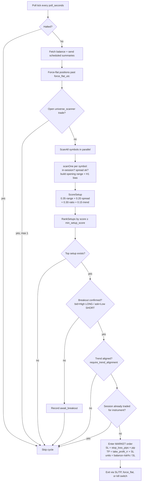

# Universe Scanner Bot (`universe_scanner`) — Logic Reference

Opening-range breakout (ORB) scanner on OANDA. Ranks a multi-instrument universe, trades **one position at a time**.

| Item | Value |
|------|-------|
| Bot ID | `universe_scanner` |
| Display name | FXPulse ORB Scanner |
| Systemd | `fxtrade@universe_scanner.service` |
| Health port | `:8081` |
| Config block | `.credentials` → `scanner` |
| State | `data/state-universe_scanner.json` |
| Trades DB | `data/universe_scanner/trades.db` |
| Journal | `logs/universe_scanner/` |
| One-shot test | `go run ./cmd/scanner-test` (defaults to dry-run) |

---

## Source map (read these, not the whole repo)

| Topic | File |
|-------|------|
| Bot wiring (risk, monitor, DB) | `internal/bots/universe_scanner/bot.go` |
| Main poll loop + entry/exit | `internal/scanner/engine.go` |
| Per-symbol scan | `internal/scanner/scan.go` |
| Opening range build | `internal/scanner/range.go` |
| Score, rank, breakout | `internal/scanner/rank.go` |
| Sessions + force-flat times | `internal/scanner/session.go` |
| Universe presets / filters | `internal/scanner/universe.go` |
| Config defaults + keys | `internal/config/scanner.go` |
| Config example | `.credentials.example` → `"scanner"` |

---

## Code organisation & storage (where to find things)

### Code layout

```
cmd/
├── fxtrade/                  # daemon that runs the bot (imports internal/bots for registration)
└── scanner-test/            # one-shot dry-run of a single scan cycle
internal/
├── bots/
│   ├── register.go          # init() registers universe_scanner into the bot platform
│   └── universe_scanner/
│       └── bot.go           # wiring: risk, monitor, trades DB, engine
├── scanner/                 # the ORB engine (all scanner-specific logic)
│   ├── engine.go            # poll loop, entry/exit, force-flat, summaries
│   ├── scan.go              # per-symbol scan (scanOne, ScanAll)
│   ├── range.go             # opening-range build + H1 trend bias
│   ├── rank.go              # ScoreSetup, RankSetups, DetectBreakout
│   ├── session.go           # session windows, force-flat / entry-cutoff times
│   ├── universe.go          # presets + account-universe filtering
│   ├── notify.go            # email notifications
│   └── schedule.go          # scheduled-summary timing
└── config/scanner.go        # ScannerConfig + DefaultScannerConfig
```

Shared platform stack (not scanner-specific): `internal/oanda`, `risk`, `execution`, `monitor`, `journal`, `state`, `store/sqlite`, `notify`, `health`, `bot`.

### Runtime artifacts (state, DB, journal, caches, logs)

Paths are relative to the working dir (`/opt/fxtrade` on the VM). Per-bot paths are derived by `internal/config/bots.go`.

| Artifact | Path | Written by | Notes |
|----------|------|-----------|-------|
| **State** | `data/state-universe_scanner.json` | `internal/state` | `StateFileForBot("data/state.json", …)`; risk snapshot, per-session entries |
| **Trades DB** (SQLite) | `data/universe_scanner/trades.db` | `internal/store/sqlite` | Tables: `trades`, `signals` (`no_setup`, `await_breakout`, `session_already_traded`, `entry_taken`) |
| **Journal** (JSONL) | `logs/universe_scanner/journal.jsonl`, `logs/universe_scanner/trades.jsonl` | `internal/journal` | Human-tailable decision + trade log |
| **Halt file** | `.halt.universe_scanner` | ops (manual) | `HaltFileForBot(".halt", …)`; presence pauses trading |
| **Candle data** | in-memory only | engine | No on-disk cache; refetched each cycle. `candle_cache_seconds` (default 60) is a reserved config knob |
| **Process logs** | systemd journal (`journalctl -u fxtrade@universe_scanner`) | slog → stdout | |

No sentiment cache (scanner uses OANDA data only).

---

## Algorithm diagram



---

## Runtime loop (every `poll_seconds`, default 10)

```
halted? → skip
balance + weekly-target email + daily/weekly summaries
force-flat any open positions past ForceFlatUTC for asset class
already have an open trade tagged universe_scanner? → skip (max 1)
ScanAll(symbols) → RankSetups(min_setup_score) → top setup
breakout confirmed? → session_already_traded? → enter market + SL/TP
```

**One trade per instrument per session:** `sessionEntered[instrument] == range.SessionOpen` blocks re-entry.

---

## Per-symbol scan (`scanOne`)

1. **In session?** Asset-class UTC window (`scanner.asset_classes.*.session_utc`). Crypto default `24/7`.
2. **Live price** — skip if not tradeable or spread > class max.
3. **Opening range** — first `opening_range_candles` complete M15 bars after session open (`opening_range_granularity`, default M15). High/low → `Range.High`, `Range.Low`, `RangePips`.
4. **H1 trend bias** — +1 / −1 / 0 from first vs last H1 candle. When `require_trend_alignment` is true (default), counter-trend breakouts are rejected (`counter_trend_breakout` signal).
5. **Entry cutoff** — when `entry_cutoff_before_force_flat_minutes` > 0 (default 120), no new scans/entries within that window before `force_flat_utc` for the asset class.
6. **Score** — reject if `range_pips/spread_pips < min_range_spread_ratio` or spread too wide.

```
score = 0.35×rangeScore + 0.20×spreadScore + 0.30×ratioScore + 0.15×trendScore
```

Defaults: `min_setup_score` 0.65, `min_range_spread_ratio` 3.0.

6. **Breakout** (on bid/ask):
   - LONG if `bid > range.High`
   - SHORT if `ask < range.Low`
   - else `await_breakout` (no order)

---

## Ranking (when multiple setups pass)

Sort descending: **score** → **range/spread ratio** → **tightest spread** → symbol name. Only **#1** is traded; runners-up go to notification only.

---

## Entry sizing and brackets

| Input | Source |
|-------|--------|
| Entry | Ask (LONG) or Bid (SHORT) |
| Stop distance | `stop_loss_pips_fx` (FX/JPY) / `stop_loss_pips_metal` (METAL) / `stop_loss_points_crypto` / `stop_loss_points_index` × pip size |
| Take profit | `take_profit_rr × stop distance` (default RR 2.1) |
| Units | `floor(balance × risk_per_trade_pct/100 / stop_distance)` |
| Balance | `balance_source`: `oanda_nav` (default), `oanda_balance`, or `config` |

Correlation ID: `universe_scanner:scan-{instrument}-{nanos}`.

---

## Exits

| Exit | Mechanism |
|------|-----------|
| Stop / TP | Set on market order at entry |
| `force_flat` | `force_flat_utc` per class (default 20:00 UTC FX/JPY/METAL/INDEX) — before NY rollover |
| Kill switch | Risk manager halt (`daily_loss_cap_pct`, default 1%) |

Signal actions logged to SQLite `signals` table: `no_setup`, `await_breakout`, `session_already_traded`, `entry_taken`.

---

## Universe

| `universe_mode` | Behavior |
|-----------------|----------|
| `preset` (default) | `universe_preset`: `volatile_phase1` (~18 symbols: volatile FX, XAU/XAG, BTC, indices, oil) |
| `watchlist` | `scanner.watchlist` array |
| `account` | All OANDA instruments filtered by `universe_filters` (types, exotics, quote currencies) |

---

## Key config knobs

| Key | Effect |
|-----|--------|
| `opening_range_candles` | Width/stability of OR (default 2 M15) |
| `min_range_spread_ratio` | Filters choppy/thin ranges |
| `min_setup_score` | Minimum quality to rank |
| `stop_loss_pips_fx` | FX/JPY stop distance in pips |
| `stop_loss_pips_metal` | METAL (XAU/XAG) stop distance in metal pips (default 50; do not reuse FX stop) |
| `require_trend_alignment` | Block LONG below H1 bias / SHORT above H1 bias |
| `entry_cutoff_before_force_flat_minutes` | No new entries N minutes before force-flat |
| `take_profit_rr` | Reward vs stop |
| `force_flat_utc` | Session-end flat per asset class |
| `risk_per_trade_pct` | Position size |
| `poll_seconds` | Scan frequency |

See `docs/guides/demo_trading_loop.md` for tweak workflow (one knob at a time, 30+ closed trades before live).

---

## vs other platform bots

| | `universe_scanner` | `fx_sentiment` | `btc_cfd` |
|--|-------------------|----------------|-----------|
| Signal | OR breakout + score | Range/trend + sentiment | M5 mean reversion |
| Universe | Many instruments | FX | BTC_USD only |
| Max open | 1 | Configurable | Own limits |

Shared stack: `oanda`, `risk`, `execution`, `monitor`, `journal`, `state`, `bot`.

**Deep dive:** `docs/specs/fx_sentiment_bot_spec.md` for the sentiment/range bot.

---

## Quick inspection commands

```bash
# One scan cycle, no orders (default dry-run)
go run ./cmd/scanner-test

# Live metrics from SQLite
go run ./cmd/bot-metrics -bot universe_scanner

# P&L + tweak suggestions
go run ./cmd/bot-analyze -bot universe_scanner

# Tail closed trades
tail -f logs/universe_scanner/trades.jsonl
```

---

## Maintenance

Keep this doc aligned with code: **`docs/guides/bot_specs_maintenance.md`**. CI runs `./scripts/code-quality.sh` on every PR.
